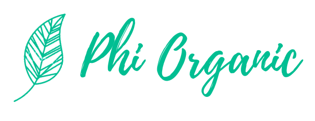

## Phi-Organic

Phi-Organic es un E-commerce de venta de productos orgánicos desarrollado con mi grupo de trabajo como proyecto integrador de Digital House, el mismo cuenta con

- Perfiles de Sesión
- Productos
- Login Popup | Formulario de registro
- Carrito de compras (Auto incremental)
- Categorías de productos
- ABM de productos
- Buscador

Es una web simple, agradable a la vista y que promueve el uso de elementos naturales y orgánicos

## ¿Cómo está compuesta?

- HTML & CSS (Vistas)
- PHP (Conexión a base de datos y formularios)
- MySQL (Almacenamiento de productos, usuarios, categorías)
- Laravel (Carrito de compras auto incremental)
- POO (Antes de arrancar con Laravel la base de datos estaba conectada con PDO)

Espero que sea de tu agrado. Lamentablemente ya no es posible visualizarla pero es apta para su descarga/clonación.
